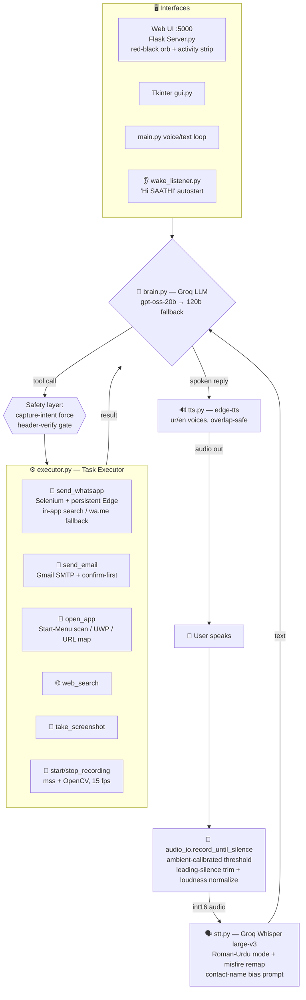

# SAATHI — System Architecture

> Multilingual (Urdu / English / Pashto) voice assistant — Mic → Whisper STT →
> LLM Brain (tool-use) → Task Executor → TTS. 100% free stack (Groq free tier,
> edge-tts, Selenium, mss/OpenCV).

---

## High-Level Flow (Mermaid — GitHub/VS Code preview mein render hota hai)



## Pipeline (ASCII — har terminal mein)

```
 ┌──────────┐   ┌───────────────┐   ┌──────────────────┐   ┌───────────────────┐   ┌─────────────┐
 │  🎤 MIC  │ → │ Whisper STT   │ → │ LLM BRAIN + TOOLS│ → │  TASK EXECUTOR    │ → │ 🔊 TTS OUT  │
 │ audio_io │   │ (Groq cloud)  │   │ gpt-oss-20b/120b │   │ wa/email/app/shot │   │  (edge-tts) │
 └──────────┘   └───────────────┘   └──────────────────┘   └───────────────────┘   └─────────────┘
      ↑            auto lang-detect      free-form intent        real actions on        voice reply in
      │            + Roman-Urdu mode     NO fixed commands       the laptop             user's language
      └────────────────────────── conversation loop ──────────────────────────────────────┘
```

## Components

| Layer | File | Kya karta hai |
|---|---|---|
| **Audio in** | `audio_io.py` | Ambient-calibrated silence detection, leading-silence trim, loudness normalization |
| **STT** | `stt.py` | Groq Whisper large-v3; Roman-Urdu mode; hi/ar→ur remap; contact-name bias prompt |
| **Brain** | `brain.py` | LLM tool-use (free-form intent). Pending send confirmations (WhatsApp + email), capture-intent safety net, deterministic screen replies |
| **Executor** | `executor.py` | Dispatch: WhatsApp / email / open_app (6-level resolution) / web_search / screen tools |
| **WhatsApp** | `whatsapp_bot.py` | Persistent pre-loaded Edge; in-app search (no reload); header verify; send verify; wa.me last resort |
| **Email** | `email_sender.py` | Gmail SMTP app-password; name→address resolution; spam-safe headers |
| **Screen** | `screen_tools.py` | mss screenshots; OpenCV MP4 recording (tick-paced, 5-min cap) → `~/Pictures/SAATHI` |
| **TTS** | `tts.py` | edge-tts ur/en/ps voices; serialized overlap-safe playback |
| **Web UI** | `Server.py` + `static/index.html` | Flask API + red-black UI: orb, equalizer beats, agent activity strip, captures gallery |
| **Desktop** | `gui.py` | Tkinter window (background-thread pipeline) |
| **Wake word** | `wake_listener.py` | "Hi SAATHI" background listener → starts server + opens browser |
| **Config** | `config.py` | Models, voices, mic thresholds, contacts |

## Key design decisions (kyun)

1. **LLM decides, code verifies** — intent kabhi hardcoded nahi; lekin har send
   (WhatsApp/email/chat-header) par deterministic verification hai. Ghalat jagah
   message jana namumkin hai.
2. **Zero-reload WhatsApp** — deep-link navigation poori web app ko dobara
   bootstrap karti hai (25–40s). Is liye app ek dafa load hoti hai; chat in-app
   search se khulti hai (pehli send ~9s, same chat ~1–2s).
3. **Safety nets over prompt-hope** — capture commands (screenshot/recording)
   unambiguous hon to LLM ke jawab ke baghair bhi force-run hote hain.
4. **Fail loud, never fake** — har failure speakable error + `wa_error.png`
   screenshot. Kabhi fake success nahi.
5. **Confirm-before-send** — WhatsApp message aur email dono pehle stage hote
   hain, user ke "haan" ke baad hi jate hain (bare haan par khali email nahi
   jati — body zaroori hai).
