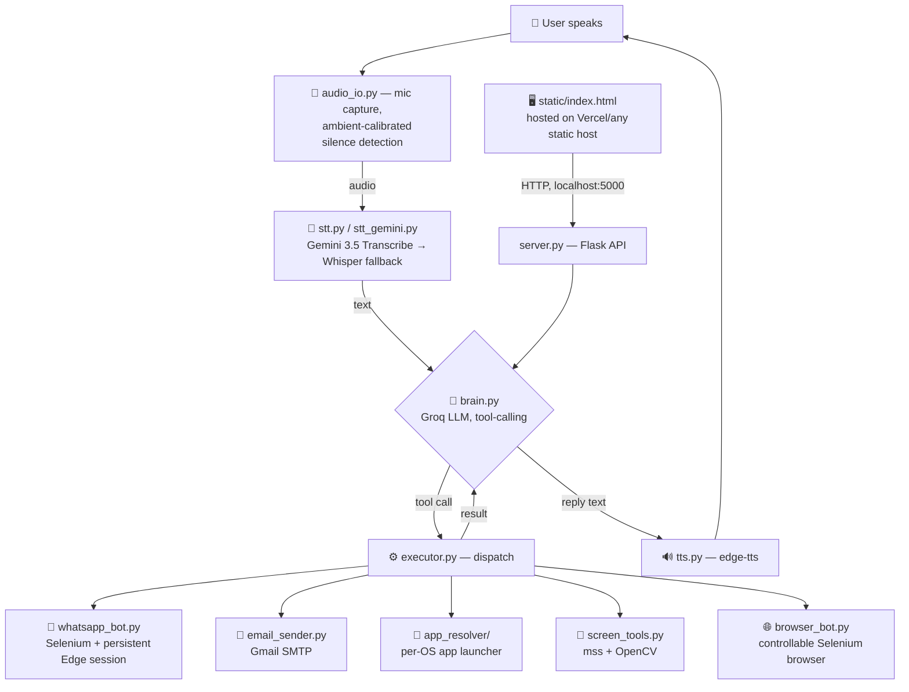

# JARVO — Multilingual Voice Assistant

> A local-first, agentic voice assistant that understands free-form spoken **Urdu, English, and Pashto**, and takes real action on the user's own computer — opening apps, sending WhatsApp messages and emails, capturing the screen, and driving a browser — all through natural conversation.


%20%7C%20macOS%20%7C%20Linux-lightgrey)


---

## 1. What JARVO Does

Speak naturally, in whatever language and phrasing feels natural, and JARVO figures out the intent — there is no fixed command list.

```
🎤 Mic  →  📝 Speech-to-Text  →  🧠 LLM Reasoning (tool use)  →  ⚙️ Task Executor  →  🔊 Spoken Reply
         (Gemini 3.5 Transcribe,      (Groq — gpt-oss-20b,           (real actions on
          Whisper fallback)            120b fallback)                 the user's PC)
```

| Capability | Example utterance | What happens |
|---|---|---|
| 🚀 Open anything | *"Notepad khol do"*, *"Open YouTube"* | Resolves and launches any installed app, Microsoft Store (UWP) app, or website — no hardcoded app list, resolved live from the system |
| 💬 WhatsApp | *"Ahmed ko hello bhejo"* | Sends a real WhatsApp message through a persistent, pre-loaded WhatsApp Web session, with header and delivery verification |
| 📧 Email | *"Sara ko email bhejo"* | Sends via Gmail SMTP, resolving the recipient from saved contacts |
| 🌐 Controlled browser | *"...is par click karo, neeche scroll karo"* | Opens a page and keeps it open across turns — click, scroll, type, switch tabs, read text aloud, and more |
| 📸 Screen capture | *"screenshot le lo"*, *"recording shuru karo"* | Saves a PNG screenshot or a real-time-paced MP4 recording to `Pictures/JARVO` |
| 🗂️ Voice-saved contacts | *"Ali ka number save karo 9230..."* | Repeats the digits back for confirmation, then writes contacts atomically to disk |
| 💾 Persistent memory | — | Conversation history is stored per session in SQLite — survives restarts and page reloads |
| 🌍 Three languages | Urdu / English / Pashto | Automatic language detection, Roman-Urdu transcription handling, and a native Pashto TTS voice |

Every action that sends something or writes data (a WhatsApp message, an email, a new contact) is **staged and spoken back for confirmation first** — nothing goes out on a single misheard word.

---

## 2. ⚠️ Important: This Is a Local Agent, Not a Cloud Backend

**This is the single most important thing to understand before judging or deploying this project.**

JARVO's actions — the microphone, the speakers, WhatsApp Web automation, screen capture, and application launching — run **on the physical computer the user is sitting at**. There is no possible way to "send a WhatsApp message from someone else's laptop" from a server sitting in the cloud; the action has to happen on that machine.

Because of this, the project is deliberately split into two independent pieces:

| Piece | What it is | Where it lives |
|---|---|---|
| **Frontend** (`static/index.html`) | The chat UI — a single static HTML/JS file | Can be deployed anywhere static hosting is available (Vercel, GitHub Pages, Netlify, etc.) |
| **Local Agent** (`Server.py` + the rest of the Python codebase) | The actual brain — STT, LLM reasoning, WhatsApp/email/browser/screen automation | **Must run on each user's own computer.** It is a small local Flask server bound to `127.0.0.1:5000` |

When the hosted webpage loads, it automatically checks `http://127.0.0.1:5000/api/health`. If the local agent is running, the two connect and the UI becomes fully functional (mic, WhatsApp, screenshots, everything). If the agent is not running, the page shows **"Start the JARVO agent to begin"** and stays inert — it can never act on anyone's machine without their own agent running first.

This means: **to actually test or judge JARVO's live capabilities, the local agent must be running on the machine being used to test it.** Opening the hosted link alone only shows the UI shell.

---

## 3. How It Works — Architecture

### Pipeline overview (plain text — renders everywhere)

```
 ┌──────────┐   ┌───────────────┐   ┌──────────────────┐   ┌────────────────────┐   ┌─────────────┐
 │  🎤 MIC  │ → │      STT      │ → │   LLM BRAIN       │ → │   TASK EXECUTOR    │ → │  🔊 TTS OUT │
 │ audio_io │   │ Gemini→Whisper│   │ Groq gpt-oss-20b/ │   │ WhatsApp / Email / │   │  edge-tts   │
 │          │   │   fallback    │   │  120b, tool-use   │   │ Apps / Screen /    │   │             │
 │          │   │               │   │                    │   │ Browser control    │   │             │
 └──────────┘   └───────────────┘   └──────────────────┘   └────────────────────┘   └─────────────┘
      ↑                                                                                      │
      └──────────────────────────── conversation loop continues ──────────────────────────────┘

 ┌─────────────────────────────┐        HTTP (localhost:5000)        ┌───────────────────────┐
 │  static/index.html          │ ───────────────────────────────────▶│  server.py (Flask)    │
 │  hosted on Vercel/any host  │◀─────────────────────────────────── │  = the "local agent"  │
 └─────────────────────────────┘         JSON responses               └───────────────────────┘
```

### Detailed component diagram (Mermaid — renders on GitHub, or in VS Code with the
"Markdown Preview Mermaid Support" extension installed)



### Core modules

| Layer | File | Responsibility |
|---|---|---|
| Entry points | `main.py`, `server.py`, `gui.py` | Voice/text CLI, Flask web API, Tkinter desktop window |
| Audio capture | `audio_io.py` | Ambient noise calibration, voice-activity detection |
| Speech-to-Text | `stt.py`, `stt_gemini.py` | Gemini 3.5 Transcribe primary, Whisper (via Groq) automatic fallback |
| Reasoning | `brain.py` | LLM tool-calling (free-form intent, no fixed command grammar), confirmation state machine for sends |
| Execution | `executor.py` | Dispatches the LLM's chosen tool to the right module |
| App launching | `app_resolver/` | Per-OS resolver: Start Menu scan + UWP apps on Windows, `/Applications` scan on macOS, `.desktop` scan on Linux |
| WhatsApp | `whatsapp_bot.py` | Persistent Selenium/Edge session, in-app search, header and delivery verification |
| Email | `email_sender.py` | Gmail SMTP with contact-name resolution |
| Screen tools | `screen_tools.py` | PNG screenshots, paced MP4 recording |
| Browser control | `browser_bot.py` | Click / scroll / type / tab control on an already-open page |
| Text-to-Speech | `tts.py` | `edge-tts` synthesis with per-language voices |
| Persistence | `chat_store.py` | SQLite-backed per-session chat history and activity log |
| Frontend | `static/index.html` | The chat UI; auto-detects and talks to the local agent |

### Tech stack (100% free tier)

- **LLM:** Groq (`openai/gpt-oss-20b` primary, `120b` fallback) — free tier
- **STT:** Google Gemini 3.5 Transcribe (optional) with Groq-hosted Whisper fallback
- **TTS:** Microsoft `edge-tts` (free, no API key)
- **Automation:** Selenium + Microsoft Edge (WhatsApp Web, controllable browser)
- **Web server:** Flask
- **Screen capture:** `mss` + OpenCV
- **Storage:** SQLite (stdlib only)

---

## 4. Repository Structure

```
saathi_assistant/
├── main.py               # voice / text CLI entry point
├── server.py             # Flask web server (the "local agent")
├── gui.py                # Tkinter desktop window
├── brain.py               # LLM reasoning + tool definitions
├── executor.py             # tool dispatch
├── config.py              # models, voices, thresholds, env loading
├── audio_io.py            # microphone capture
├── stt.py / stt_gemini.py  # speech-to-text
├── tts.py                 # text-to-speech
├── whatsapp_bot.py         # WhatsApp Web automation
├── email_sender.py         # Gmail SMTP sending
├── screen_tools.py         # screenshots + recording
├── browser_bot.py          # controllable browser
├── chat_store.py           # SQLite chat history
├── app_resolver/           # per-OS app launcher (windows/macos/linux)
├── static/index.html       # hosted frontend
├── tests/                  # 95+ offline unit tests (mocked, no API keys)
├── requirements.txt
├── install_windows.bat     # one-click Windows setup
├── vercel.json             # config for deploying static/ as the frontend
└── .env.example             # environment variable template
```

---

## 5. Deployment Model for This Submission

For this hackathon, the deployment is split exactly as described in Section 2:

1. **Frontend** (`static/index.html`) is deployed to **Vercel** as a static site.
2. **The local agent** (this Python repository) is run by each individual user/judge on their own machine.
3. When a judge opens the Vercel URL, the page automatically looks for the agent at `http://127.0.0.1:5000`. Once the judge starts the local agent (Section 6 below), the hosted page connects to it and every feature becomes live — running entirely on the judge's own computer.

An explicit agent address can also be forced via a URL query parameter, useful if the agent is exposed on a non-default port or a LAN address:

```
https://your-vercel-url.vercel.app/?agent=http://127.0.0.1:5000
```

---

## 6. Setup Instructions for Judges (Run the Local Agent)

To evaluate JARVO's live functionality (voice, WhatsApp, screenshots, app launching, etc.), please run the local agent on your own computer following the steps below. **Windows is the primary supported platform** — some automation features (app launching, WhatsApp session recovery) rely on Windows-specific APIs and are best exercised on Windows.

### Prerequisites

- **Windows 10/11** (recommended), or macOS/Linux with reduced feature coverage
- **Python 3.10 or newer** — [python.org/downloads](https://www.python.org/downloads/)
- **Microsoft Edge** installed (used for the WhatsApp/browser automation)
- A **free Groq API key** — [console.groq.com/keys](https://console.groq.com/keys)
- A working microphone and speakers (for the voice pipeline)

### Option A — One-click Windows setup (recommended)

1. Download or clone this repository.
2. Double-click `install_windows.bat`.
3. The script will:
   - Create a Python virtual environment
   - Install all dependencies from `requirements.txt`
   - Prompt for your Groq API key and write it to `.env`
   - Start the local agent (`server.py`) and open the local JARVO page

> This step does **not** log in to WhatsApp automatically. See "Enabling WhatsApp" below if you'd like to test that feature.

### Option B — Manual setup (Windows)

```powershell
git clone <this-repository-url>
cd saathi_assistant

python -m venv venv
venv\Scripts\activate
pip install -r requirements.txt

copy .env.example .env
REM Open .env in a text editor and set GROQ_API_KEY=<your key>

venv\Scripts\python server.py
```

### Option B — Manual setup (macOS / Linux)

```bash
git clone <this-repository-url>
cd saathi_assistant

python3 -m venv .venv
source .venv/bin/activate
pip install -r requirements.txt

cp .env.example .env
# Edit .env and set GROQ_API_KEY=<your key>

python3 server.py
```

### Verify the agent is running

Once `server.py` starts, it prints a startup banner and begins listening on port 5000. Confirm it is healthy:

```bash
curl http://127.0.0.1:5000/api/health
```

Expected response:

```json
{ "ok": true, "agent": "jarvo", "service": "local" }
```

### Connect to the hosted frontend

1. Open the deployed Vercel link in a browser **on the same machine** running the agent (e.g. `https://<your-project>.vercel.app`).
2. The page will automatically detect the agent at `127.0.0.1:5000` and display **"JARVO agent connected."**
3. Start talking, typing, or using any of the UI's action buttons.

If the status instead shows **"Start the JARVO agent to begin,"** it means `server.py` is not running or not reachable — return to the steps above.

### Enabling WhatsApp (optional)

WhatsApp messaging requires a one-time QR login, since it drives your own real WhatsApp Web session:

```powershell
venv\Scripts\python whatsapp_login.py
```

Scan the QR code with your phone's WhatsApp app. The session is then saved locally and reused on every subsequent run — no need to scan again.

### Enabling Email (optional)

Add to `.env`:

```env
EMAIL_ADDRESS=your_account@gmail.com
EMAIL_APP_PASSWORD=your_16_char_app_password
```

An **App Password** (not your normal Gmail password) is required — generate one under Google Account → Security → 2-Step Verification → App Passwords, after enabling 2-Step Verification.

### Environment variables reference (`.env`)

| Variable | Required | Purpose |
|---|---|---|
| `GROQ_API_KEY` | ✅ Yes | LLM reasoning (Groq free tier) |
| `GROQ_API_KEY_STT` | Optional | Separate Whisper quota bucket (falls back to `GROQ_API_KEY` if unset) |
| `GEMINI_API_KEY` | Optional | Enables Gemini 3.5 Transcribe as the primary STT engine (better Urdu/Pashto accuracy) |
| `EMAIL_ADDRESS` / `EMAIL_APP_PASSWORD` | Optional | Enables email sending |
| `JARVO_TOKEN` | Optional | Shared-secret auth if exposing the agent beyond `localhost` |
| `JARVO_HOST` | Optional | Bind address for `server.py` (defaults to `127.0.0.1`, i.e. this machine only) |

---

## 7. Running JARVO Without the Hosted Frontend

The local agent also serves its own UI directly, and offers CLI modes for quick testing without a browser:

```bash
venv\Scripts\python server.py          # Web UI → http://localhost:5000
venv\Scripts\python main.py            # voice mode (CLI)
venv\Scripts\python main.py --text     # text mode (CLI, no mic needed)
venv\Scripts\python gui.py             # Tkinter desktop window
```

---

## 8. Testing

The project ships with 95+ fully offline unit tests (mocked LLM/APIs, no keys required):

```bash
venv\Scripts\python -m pytest tests/ -v
```

Continuous Integration runs compile checks across all modules plus the full offline test suite on every push.

---

## 9. Security & Privacy Notes

- The local agent binds to `127.0.0.1` by default — reachable only from the machine it runs on. Setting `JARVO_HOST=0.0.0.0` (to allow other devices on the same network) requires also setting `JARVO_TOKEN` to protect it.
- Personal files (`.env`, `contacts.json`, `email_contacts.json`, `jarvo.db`) are `.gitignore`d — only template files are committed.
- Every send (WhatsApp/email) and every new contact requires spoken or typed confirmation before it happens.
- The CORS configuration currently allows the hosted frontend to reach the local agent — this is intentional for this demo/hackathon setup and should be tightened for any production deployment.
- The local agent has broad desktop permissions by design (it opens applications and captures the screen); only run it on machines you trust and control.

---

## 10. Known Limitations

- WhatsApp automation depends on WhatsApp Web's DOM structure; upstream UI changes may require selector updates (`wa_doctor.py` is included for diagnosing this).
- STT and LLM calls require internet connectivity and depend on Groq/Google's free-tier availability; the assistant degrades gracefully (spoken fallback messages) during outages.
- Screen recording is capped at 5 minutes per clip at 15 fps as a safety limit.
- Full feature parity (app launching, WhatsApp session recovery helpers) is currently strongest on Windows; macOS and Linux resolvers exist but are less extensively tested.
- Each user/judge needs their own Groq API key and their own WhatsApp QR login — there is no shared multi-tenant backend in this version.

---

## 11. Quick Reference for Judges

| Step | Action |
|---|---|
| 1 | Clone/download this repository |
| 2 | Run `install_windows.bat` (or the manual setup steps) |
| 3 | Add your free Groq API key to `.env` |
| 4 | Run `python server.py` |
| 5 | Open the hosted Vercel link in a browser on the same machine |
| 6 | Confirm the page shows "JARVO agent connected" |
| 7 | Talk or type — JARVO is now live on your machine |